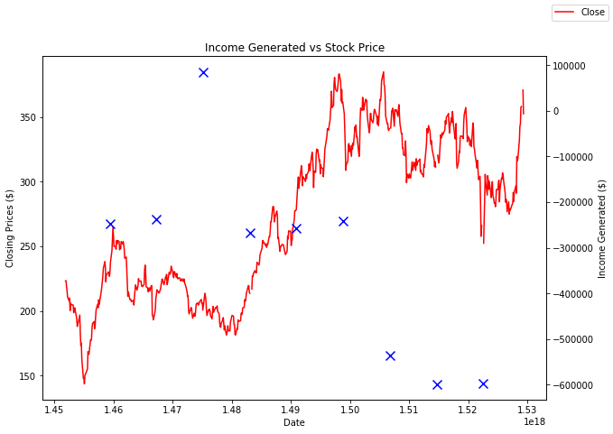
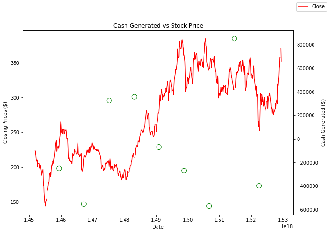
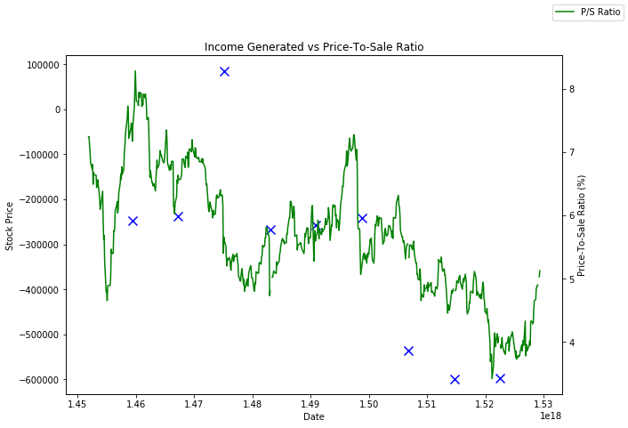
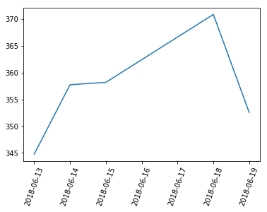
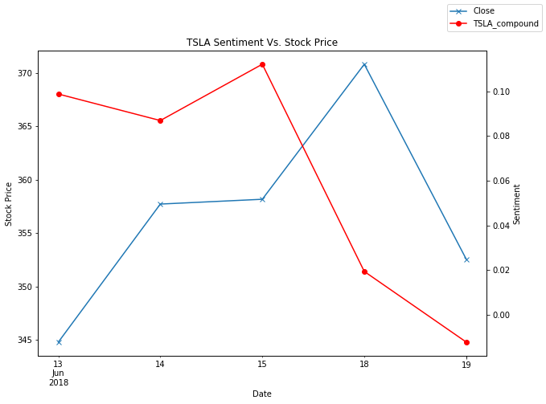
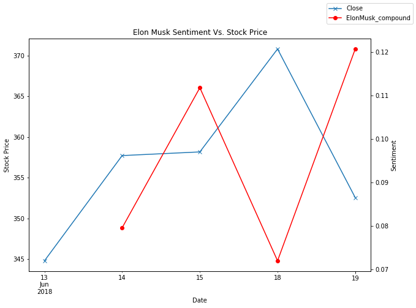
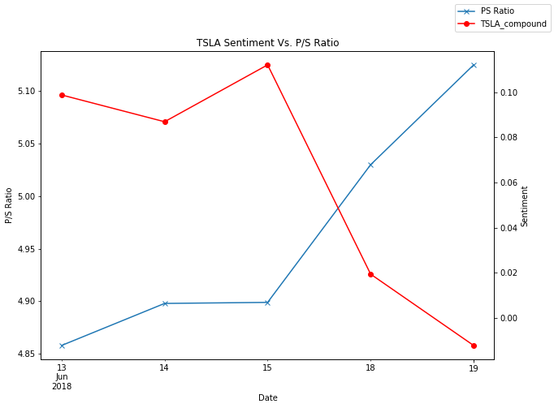
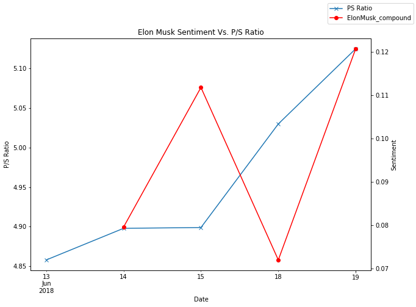

# TESLA STOCK ANALYSIS


Discover if there is a relationship amongst stock price, price to sales ratio, twitter sentiment and financial statements for Tesla.


## Tesla Data sources


* SEC Filings


* Twitter


*  Yahoo Historical Stock Data


*  Zacks.com

## Lessons Learned


1) Historical twitter data is not easily accessible without a paid license


2) GMT to PST date conversion


3) Merging multiple data sources


4) Plotting with multiple y-axis


5) Working with various date formats


6) Understand your underlying data


### >>> Financials Section >>>

### Pipeline - Begin


```python
# dependencies
import pandas as pd
import seaborn as sns
import numpy as np
import matplotlib.pyplot as plt

from datetime import datetime
from datetime import timedelta

# import and initialize Sentiment Analyzer
from vaderSentiment.vaderSentiment import SentimentIntensityAnalyzer
analyzer = SentimentIntensityAnalyzer()
```


```python
# financial data resources
financials = "./Resources/Tesla Financials/Testla Operations Financials.xlsx"
stock_price = "./Resources/Tesla Stock Price/TSLAstock.xlsx"
ps_ratio = "./Resources/Tesla Stock Price/TSLApsratio.xlsx"
twitter = "./Resources/Tesla Twitter/twitter tweets.xlsx"

# twitter data resources
tsla_tweet = pd.read_csv("Resources/tslatweets.csv")
elonmusk_tweet = pd.read_csv("Resources/ElonMusktweets.csv")
tsla_stock = pd.read_csv("Resources/TSLA_stock.csv")
```


```python
# set df_variable: financial statement
financials_excel = pd.read_excel(financials)
financials_df = financials_excel[["date","operating_income","cf_from_operations"]]
```


```python
# set df_variabel: stock price
stock_price_excel = pd.read_excel(stock_price)
stock_price_df = stock_price_excel[["date","Close","Volume"]]
```


```python
# set df_variable: price-to-sales ratio
ps_ratio_xlsx = pd.read_excel(ps_ratio)
ps_ratio_df = ps_ratio_xlsx[["date","P/S Ratio"]]
```


```python
# set df_variable: twitter sentiment
twitter_csv = pd.read_excel(twitter)
twitter_df = twitter_csv[["date","TSLA_compound","ElonMusk_compound"]]
```


```python
# merge: financials and stock price (AS: tesla_df_1)
tesla_df_1 = pd.merge(financials_df,stock_price_df, how="outer",on="date")
```


```python
# merge: tesla_df_1 and ps ratio (AS: tesla_df_2)
tesla_df_2 = pd.merge(tesla_df_1,ps_ratio_df, how="outer",on="date")
```


```python
# merge: tesla_df_2 and twitter (AS: tesla_df_3)
tesla_df_3 = pd.merge(tesla_df_2,twitter_df, how="outer",on="date")
```


```python
# converting column: convert 'date' column to pandas.to_datetime(), THEN adding it as a new column to df
tesla_df_3["date_converted"] = pd.to_datetime(tesla_df_3["date"])
```


```python
# converting column: convert 'date' column to pandas.to_numeric(), THEN adding it as a new column to df
tesla_df_3["date_converted_to_numeric"] = pd.to_numeric(tesla_df_3["date_converted"])
```


```python
# sort: by date (final wrangling/applying as: tesla_df )
tesla_df = tesla_df_3.sort_values(by=["date_converted"],ascending = False)
tesla_df.head()

# use to this code: to audit via excel
# tesla_df.to_csv("tesla_df.csv",index=False,header=True)
```

<!-- 


<div>
<style scoped>
    .dataframe tbody tr th:only-of-type {
        vertical-align: middle;
    }

    .dataframe tbody tr th {
        vertical-align: top;
    }

    .dataframe thead th {
        text-align: right;
    }
</style> -->


<table border="1" class="dataframe">
  <thead>
    <tr style="text-align: right;">
      <th></th>
      <th>date</th>
      <th>operating_income</th>
      <th>cf_from_operations</th>
      <th>Close</th>
      <th>Volume</th>
      <th>P/S Ratio</th>
      <th>TSLA_compound</th>
      <th>ElonMusk_compound</th>
      <th>date_converted</th>
      <th>date_converted_to_numeric</th>
    </tr>
  </thead>
  <tbody>
    <tr>
      <th>623</th>
      <td>2018-06-19</td>
      <td>NaN</td>
      <td>NaN</td>
      <td>352.550000</td>
      <td>12537147.0</td>
      <td>5.125</td>
      <td>0.078213</td>
      <td>0.078213</td>
      <td>2018-06-19</td>
      <td>1529366400000000000</td>
    </tr>
    <tr>
      <th>622</th>
      <td>2018-06-18</td>
      <td>NaN</td>
      <td>NaN</td>
      <td>370.829987</td>
      <td>11985600.0</td>
      <td>5.030</td>
      <td>0.108785</td>
      <td>0.108785</td>
      <td>2018-06-18</td>
      <td>1529280000000000000</td>
    </tr>
    <tr>
      <th>625</th>
      <td>2018-06-17</td>
      <td>NaN</td>
      <td>NaN</td>
      <td>NaN</td>
      <td>NaN</td>
      <td>NaN</td>
      <td>0.130824</td>
      <td>0.130824</td>
      <td>2018-06-17</td>
      <td>1529193600000000000</td>
    </tr>
    <tr>
      <th>624</th>
      <td>2018-06-16</td>
      <td>NaN</td>
      <td>NaN</td>
      <td>NaN</td>
      <td>NaN</td>
      <td>NaN</td>
      <td>0.130824</td>
      <td>0.130824</td>
      <td>2018-06-16</td>
      <td>1529107200000000000</td>
    </tr>
    <tr>
      <th>621</th>
      <td>2018-06-15</td>
      <td>NaN</td>
      <td>NaN</td>
      <td>358.170013</td>
      <td>10848300.0</td>
      <td>4.899</td>
      <td>0.108785</td>
      <td>0.108785</td>
      <td>2018-06-15</td>
      <td>1529020800000000000</td>
    </tr>
  </tbody>
</table>
</div>


### Pipeline - End


```python
len(tesla_df["date"])
```


    626


```python
tesla_df.dtypes
```


    date                                 object
    operating_income                    float64
    cf_from_operations                  float64
    Close                               float64
    Volume                              float64
    P/S Ratio                           float64
    TSLA_compound                       float64
    ElonMusk_compound                   float64
    date_converted               datetime64[ns]
    date_converted_to_numeric             int64
    dtype: object


### *** Financial Graphs ***

## Reuben's code


```python
# Plot - Operating Income vs Closing Prices

plt.figure(figsize=(900,6))

ax = tesla_df.plot(x="date_converted_to_numeric",
                   y="Close",
                   legend=False,
                   color="Red")
    
ax2 = ax.twinx()

tesla_df.plot(x="date_converted_to_numeric",
              y="operating_income",
              kind="scatter",
              marker='x',
              alpha=1,
              c="blue",
              s=100,
              edgecolor="green",
              legend=False,
              figsize=(10,7),
              ax=ax2)

ax.figure.legend()

plt.title("Income Generated vs Stock Price")
ax.set_xlabel("Date")
ax.set_ylabel("Closing Prices ($)")
ax2.set_ylabel("Income Generated ($)")

plt.savefig("Income Generated vs Stock Prices.png")
```


    <matplotlib.figure.Figure at 0x1cd57089fd0>





```python
# Plot - CASH Generated from Business Operations vs Closing Prices

# Plot - Operating Income vs Closing Prices

plt.figure(figsize=(900,6))

ax = tesla_df.plot(x="date_converted_to_numeric",
                   y="Close",
                   legend=False,
                   color="Red")
    
ax2 = ax.twinx()

tesla_df.plot(x="date_converted_to_numeric",
              y="cf_from_operations",
              kind="scatter",
              marker='o',
              alpha=1,
              c="none",
              s=100,
              edgecolor="green",
              legend=False,
              figsize=(10,7),
              ax=ax2)

ax.figure.legend()

plt.title("Cash Generated vs Stock Price")
ax.set_xlabel("Date")
ax.set_ylabel("Closing Prices ($)")
ax2.set_ylabel("Cash Generated ($)")

plt.savefig("Cash Generated vs Stock Prices.png")
```


    <matplotlib.figure.Figure at 0x1cd574aa160>





## Andy's code


```python
# plot - Stock Price vs PS ratio

andy_df = tesla_df[["date","Close","P/S Ratio"]].dropna(how="any")

ax = andy_df.plot(x="date",
                  y="Close",
                  legend=False,
                  color="red")

ax2 = ax.twinx()

andy_df.plot(x="date",
             y="P/S Ratio",
             ax=ax2,
             legend=False,
             color="Green",
             figsize=(10,7))

ax.figure.legend()

plt.title("Stock Price vs Price-To-Sale Ratio")
ax.set_xlabel("Date")
ax.set_ylabel("Stock Price ($)")
ax2.set_ylabel("Price-To-Sale Ratio (%)")


plt.savefig("Stock Price vs Price-To_Sale Ratio.png")
```


```python
# plot - Operating Income vs PS ratio

plt.figure(figsize=(900,6))

ax = tesla_df.plot(x="date_converted_to_numeric",
                   y="operating_income",
                   marker='x',
                   legend=False,
                   color="blue",
                   kind="scatter",
                   s=100)

ax2 = ax.twinx()

tesla_df.plot(x="date_converted_to_numeric",
             y="P/S Ratio",
             ax=ax2,
             legend=False,
             color="Green",
             figsize=(10,7))

# plt.xticks(tesla_df["date_converted_to_numeric"], tesla_df["date"], rotation='vertical')

ax.figure.legend()

plt.title("Income Generated vs Price-To-Sale Ratio")
ax.set_xlabel("Date")
ax.set_ylabel("Stock Price")
ax2.set_ylabel("Price-To-Sale Ratio (%)")

plt.savefig("Operating Income vs Price-To_Sale Ratio.png")
```


    <matplotlib.figure.Figure at 0x1cd57e44208>





### >>> Twitter section >>>

## Carla's code


```python
#Convert Date column to Pandas Date Time format
tsla_tweet["Date"] = pd.to_datetime(tsla_tweet["Date"])
elonmusk_tweet["Date"] = pd.to_datetime(elonmusk_tweet["Date"])
tsla_stock["Date"] = pd.to_datetime(tsla_stock["Date"])
```


```python
tsla_tweet.head()
```


<!-- 
<div>
<style scoped>
    .dataframe tbody tr th:only-of-type {
        vertical-align: middle;
    }

    .dataframe tbody tr th {
        vertical-align: top;
    }

    .dataframe thead th {
        text-align: right;
    }
</style> -->

<table border="1" class="dataframe">
  <thead>
    <tr style="text-align: right;">
      <th></th>
      <th>Count</th>
      <th>Compound</th>
      <th>Date</th>
      <th>Neutral</th>
      <th>Negative</th>
      <th>Positive</th>
      <th>Tweet</th>
      <th>User</th>
    </tr>
  </thead>
  <tbody>
    <tr>
      <th>0</th>
      <td>0</td>
      <td>0.0000</td>
      <td>2018-06-15 03:28:15</td>
      <td>1.000</td>
      <td>0.000</td>
      <td>0.000</td>
      <td>Check out the companies producing headlines be...</td>
      <td>easier2live</td>
    </tr>
    <tr>
      <th>1</th>
      <td>1</td>
      <td>-0.6486</td>
      <td>2018-06-15 03:28:07</td>
      <td>0.538</td>
      <td>0.462</td>
      <td>0.000</td>
      <td>$TSLA shorts are literally dead. https://t.co/...</td>
      <td>BankofVol</td>
    </tr>
    <tr>
      <th>2</th>
      <td>2</td>
      <td>0.3818</td>
      <td>2018-06-15 03:26:31</td>
      <td>0.698</td>
      <td>0.000</td>
      <td>0.302</td>
      <td>RT @TeslaCharts: Growth synergies bro.\r\n$TSL...</td>
      <td>librab103</td>
    </tr>
    <tr>
      <th>3</th>
      <td>3</td>
      <td>0.2263</td>
      <td>2018-06-15 03:25:38</td>
      <td>0.667</td>
      <td>0.133</td>
      <td>0.200</td>
      <td>RT @MelaynaLokosky: Fraud is not a sustainable...</td>
      <td>engineerhunter</td>
    </tr>
    <tr>
      <th>4</th>
      <td>4</td>
      <td>0.0000</td>
      <td>2018-06-15 03:23:50</td>
      <td>1.000</td>
      <td>0.000</td>
      <td>0.000</td>
      <td>RT @blainefundlp: Obviously Bullish $TSLA  htt...</td>
      <td>Marcelozinn</td>
    </tr>
  </tbody>
</table>
</div>


```python
elonmusk_tweet.head()
```


<!-- 
<div>
<style scoped>
    .dataframe tbody tr th:only-of-type {
        vertical-align: middle;
    }

    .dataframe tbody tr th {
        vertical-align: top;
    }

    .dataframe thead th {
        text-align: right;
    }
</style> -->

<table border="1" class="dataframe">
  <thead>
    <tr style="text-align: right;">
      <th></th>
      <th>Count</th>
      <th>Compound</th>
      <th>Date</th>
      <th>Neutral</th>
      <th>Negative</th>
      <th>Positive</th>
      <th>Tweet</th>
      <th>User</th>
    </tr>
  </thead>
  <tbody>
    <tr>
      <th>0</th>
      <td>0</td>
      <td>-0.3182</td>
      <td>2018-06-15 03:55:39</td>
      <td>0.905</td>
      <td>0.095</td>
      <td>0.000</td>
      <td>RT @tictoc: .@elonmusk says the Boring Co.’s h...</td>
      <td>LewisFranck</td>
    </tr>
    <tr>
      <th>1</th>
      <td>1</td>
      <td>-0.4019</td>
      <td>2018-06-15 03:55:21</td>
      <td>0.769</td>
      <td>0.231</td>
      <td>0.000</td>
      <td>@tictoc @elonmusk Anything the deflect from th...</td>
      <td>IanA_Aus</td>
    </tr>
    <tr>
      <th>2</th>
      <td>2</td>
      <td>0.6697</td>
      <td>2018-06-15 03:55:06</td>
      <td>0.814</td>
      <td>0.000</td>
      <td>0.186</td>
      <td>@tictoc @elonmusk He is quite clearly on some ...</td>
      <td>__R_Adair__</td>
    </tr>
    <tr>
      <th>3</th>
      <td>3</td>
      <td>-0.3182</td>
      <td>2018-06-15 03:54:44</td>
      <td>0.905</td>
      <td>0.095</td>
      <td>0.000</td>
      <td>RT @tictoc: .@elonmusk says the Boring Co.’s h...</td>
      <td>shauntheyawn</td>
    </tr>
    <tr>
      <th>4</th>
      <td>4</td>
      <td>0.0000</td>
      <td>2018-06-15 03:54:28</td>
      <td>1.000</td>
      <td>0.000</td>
      <td>0.000</td>
      <td>RT @MonsNoobis: @seekevinrun @elonmusk @boring...</td>
      <td>paizurizilla</td>
    </tr>
  </tbody>
</table>
</div>


```python
tsla_stock.head()
```


<!-- 
<div>
<style scoped>
    .dataframe tbody tr th:only-of-type {
        vertical-align: middle;
    }

    .dataframe tbody tr th {
        vertical-align: top;
    }

    .dataframe thead th {
        text-align: right;
    }
</style> -->

<table border="1" class="dataframe">
  <thead>
    <tr style="text-align: right;">
      <th></th>
      <th>Date</th>
      <th>Open</th>
      <th>High</th>
      <th>Low</th>
      <th>Close</th>
      <th>Adj Close</th>
      <th>Volume</th>
      <th>PS Ratio</th>
    </tr>
  </thead>
  <tbody>
    <tr>
      <th>0</th>
      <td>2018-06-13</td>
      <td>346.709991</td>
      <td>347.200012</td>
      <td>339.799988</td>
      <td>344.779999</td>
      <td>344.779999</td>
      <td>9469800</td>
      <td>4.858</td>
    </tr>
    <tr>
      <th>1</th>
      <td>2018-06-14</td>
      <td>347.630005</td>
      <td>358.750000</td>
      <td>346.600006</td>
      <td>357.720001</td>
      <td>357.720001</td>
      <td>10981000</td>
      <td>4.898</td>
    </tr>
    <tr>
      <th>2</th>
      <td>2018-06-15</td>
      <td>353.839996</td>
      <td>364.670013</td>
      <td>351.250000</td>
      <td>358.170013</td>
      <td>358.170013</td>
      <td>10531700</td>
      <td>4.899</td>
    </tr>
    <tr>
      <th>3</th>
      <td>2018-06-18</td>
      <td>355.400000</td>
      <td>373.730000</td>
      <td>354.500000</td>
      <td>370.830000</td>
      <td>370.830000</td>
      <td>11693075</td>
      <td>5.030</td>
    </tr>
    <tr>
      <th>4</th>
      <td>2018-06-19</td>
      <td>365.160000</td>
      <td>370.000000</td>
      <td>346.250000</td>
      <td>352.550000</td>
      <td>352.550000</td>
      <td>12537147</td>
      <td>5.125</td>
    </tr>
  </tbody>
</table>
</div>


```python
# add new date column - converted "DATE" to PST
tsla_tweet["datetime_pst"] = tsla_tweet['Date'].map(lambda x: x-timedelta(hours = 8))
#tsla_tweet
elonmusk_tweet["datetime_pst"] = elonmusk_tweet['Date'].map(lambda x: x-timedelta(hours = 8))
#elonmusk_tweet

```


```python
# add new date only column based on new column above datetime_pst
tsla_tweet["date_only"] = tsla_tweet['datetime_pst'].map(lambda x: datetime.date(x))
tsla_tweet.head()
```


<!-- 
<div>
<style scoped>
    .dataframe tbody tr th:only-of-type {
        vertical-align: middle;
    }

    .dataframe tbody tr th {
        vertical-align: top;
    }

    .dataframe thead th {
        text-align: right;
    }
</style> -->


<table border="1" class="dataframe">
  <thead>
    <tr style="text-align: right;">
      <th></th>
      <th>Count</th>
      <th>Compound</th>
      <th>Date</th>
      <th>Neutral</th>
      <th>Negative</th>
      <th>Positive</th>
      <th>Tweet</th>
      <th>User</th>
      <th>datetime_pst</th>
      <th>date_only</th>
    </tr>
  </thead>
  <tbody>
    <tr>
      <th>0</th>
      <td>0</td>
      <td>0.0000</td>
      <td>2018-06-15 03:28:15</td>
      <td>1.000</td>
      <td>0.000</td>
      <td>0.000</td>
      <td>Check out the companies producing headlines be...</td>
      <td>easier2live</td>
      <td>2018-06-14 19:28:15</td>
      <td>2018-06-14</td>
    </tr>
    <tr>
      <th>1</th>
      <td>1</td>
      <td>-0.6486</td>
      <td>2018-06-15 03:28:07</td>
      <td>0.538</td>
      <td>0.462</td>
      <td>0.000</td>
      <td>$TSLA shorts are literally dead. https://t.co/...</td>
      <td>BankofVol</td>
      <td>2018-06-14 19:28:07</td>
      <td>2018-06-14</td>
    </tr>
    <tr>
      <th>2</th>
      <td>2</td>
      <td>0.3818</td>
      <td>2018-06-15 03:26:31</td>
      <td>0.698</td>
      <td>0.000</td>
      <td>0.302</td>
      <td>RT @TeslaCharts: Growth synergies bro.\r\n$TSL...</td>
      <td>librab103</td>
      <td>2018-06-14 19:26:31</td>
      <td>2018-06-14</td>
    </tr>
    <tr>
      <th>3</th>
      <td>3</td>
      <td>0.2263</td>
      <td>2018-06-15 03:25:38</td>
      <td>0.667</td>
      <td>0.133</td>
      <td>0.200</td>
      <td>RT @MelaynaLokosky: Fraud is not a sustainable...</td>
      <td>engineerhunter</td>
      <td>2018-06-14 19:25:38</td>
      <td>2018-06-14</td>
    </tr>
    <tr>
      <th>4</th>
      <td>4</td>
      <td>0.0000</td>
      <td>2018-06-15 03:23:50</td>
      <td>1.000</td>
      <td>0.000</td>
      <td>0.000</td>
      <td>RT @blainefundlp: Obviously Bullish $TSLA  htt...</td>
      <td>Marcelozinn</td>
      <td>2018-06-14 19:23:50</td>
      <td>2018-06-14</td>
    </tr>
  </tbody>
</table>
</div>


```python
# add new date only column based on new column above datetime_pst
elonmusk_tweet["date_only"] = elonmusk_tweet['datetime_pst'].map(lambda x: datetime.date(x))
elonmusk_tweet.head()
```


<!-- 
<div>
<style scoped>
    .dataframe tbody tr th:only-of-type {
        vertical-align: middle;
    }

    .dataframe tbody tr th {
        vertical-align: top;
    }

    .dataframe thead th {
        text-align: right;
    }
</style> -->


<table border="1" class="dataframe">
  <thead>
    <tr style="text-align: right;">
      <th></th>
      <th>Count</th>
      <th>Compound</th>
      <th>Date</th>
      <th>Neutral</th>
      <th>Negative</th>
      <th>Positive</th>
      <th>Tweet</th>
      <th>User</th>
      <th>datetime_pst</th>
      <th>date_only</th>
    </tr>
  </thead>
  <tbody>
    <tr>
      <th>0</th>
      <td>0</td>
      <td>-0.3182</td>
      <td>2018-06-15 03:55:39</td>
      <td>0.905</td>
      <td>0.095</td>
      <td>0.000</td>
      <td>RT @tictoc: .@elonmusk says the Boring Co.’s h...</td>
      <td>LewisFranck</td>
      <td>2018-06-14 19:55:39</td>
      <td>2018-06-14</td>
    </tr>
    <tr>
      <th>1</th>
      <td>1</td>
      <td>-0.4019</td>
      <td>2018-06-15 03:55:21</td>
      <td>0.769</td>
      <td>0.231</td>
      <td>0.000</td>
      <td>@tictoc @elonmusk Anything the deflect from th...</td>
      <td>IanA_Aus</td>
      <td>2018-06-14 19:55:21</td>
      <td>2018-06-14</td>
    </tr>
    <tr>
      <th>2</th>
      <td>2</td>
      <td>0.6697</td>
      <td>2018-06-15 03:55:06</td>
      <td>0.814</td>
      <td>0.000</td>
      <td>0.186</td>
      <td>@tictoc @elonmusk He is quite clearly on some ...</td>
      <td>__R_Adair__</td>
      <td>2018-06-14 19:55:06</td>
      <td>2018-06-14</td>
    </tr>
    <tr>
      <th>3</th>
      <td>3</td>
      <td>-0.3182</td>
      <td>2018-06-15 03:54:44</td>
      <td>0.905</td>
      <td>0.095</td>
      <td>0.000</td>
      <td>RT @tictoc: .@elonmusk says the Boring Co.’s h...</td>
      <td>shauntheyawn</td>
      <td>2018-06-14 19:54:44</td>
      <td>2018-06-14</td>
    </tr>
    <tr>
      <th>4</th>
      <td>4</td>
      <td>0.0000</td>
      <td>2018-06-15 03:54:28</td>
      <td>1.000</td>
      <td>0.000</td>
      <td>0.000</td>
      <td>RT @MonsNoobis: @seekevinrun @elonmusk @boring...</td>
      <td>paizurizilla</td>
      <td>2018-06-14 19:54:28</td>
      <td>2018-06-14</td>
    </tr>
  </tbody>
</table>
</div>


```python
# Reorganizing the columns using double brackets
tsla_sentiment = tsla_tweet[["date_only", "Compound","Negative","Neutral","Positive"]]
tsla_sentiment.head()
```


<!-- 
<div>
<style scoped>
    .dataframe tbody tr th:only-of-type {
        vertical-align: middle;
    }

    .dataframe tbody tr th {
        vertical-align: top;
    }

    .dataframe thead th {
        text-align: right;
    }
</style> -->


<table border="1" class="dataframe">
  <thead>
    <tr style="text-align: right;">
      <th></th>
      <th>date_only</th>
      <th>Compound</th>
      <th>Negative</th>
      <th>Neutral</th>
      <th>Positive</th>
    </tr>
  </thead>
  <tbody>
    <tr>
      <th>0</th>
      <td>2018-06-14</td>
      <td>0.0000</td>
      <td>0.000</td>
      <td>1.000</td>
      <td>0.000</td>
    </tr>
    <tr>
      <th>1</th>
      <td>2018-06-14</td>
      <td>-0.6486</td>
      <td>0.462</td>
      <td>0.538</td>
      <td>0.000</td>
    </tr>
    <tr>
      <th>2</th>
      <td>2018-06-14</td>
      <td>0.3818</td>
      <td>0.000</td>
      <td>0.698</td>
      <td>0.302</td>
    </tr>
    <tr>
      <th>3</th>
      <td>2018-06-14</td>
      <td>0.2263</td>
      <td>0.133</td>
      <td>0.667</td>
      <td>0.200</td>
    </tr>
    <tr>
      <th>4</th>
      <td>2018-06-14</td>
      <td>0.0000</td>
      <td>0.000</td>
      <td>1.000</td>
      <td>0.000</td>
    </tr>
  </tbody>
</table>
</div>


```python
# Reorganizing the columns using double brackets
elonmusk_sentiment = elonmusk_tweet[["date_only", "Compound","Negative","Neutral","Positive"]]
elonmusk_sentiment.head()
```


<!-- 
<div>
<style scoped>
    .dataframe tbody tr th:only-of-type {
        vertical-align: middle;
    }

    .dataframe tbody tr th {
        vertical-align: top;
    }

    .dataframe thead th {
        text-align: right;
    }
</style> -->


<table border="1" class="dataframe">
  <thead>
    <tr style="text-align: right;">
      <th></th>
      <th>date_only</th>
      <th>Compound</th>
      <th>Negative</th>
      <th>Neutral</th>
      <th>Positive</th>
    </tr>
  </thead>
  <tbody>
    <tr>
      <th>0</th>
      <td>2018-06-14</td>
      <td>-0.3182</td>
      <td>0.095</td>
      <td>0.905</td>
      <td>0.000</td>
    </tr>
    <tr>
      <th>1</th>
      <td>2018-06-14</td>
      <td>-0.4019</td>
      <td>0.231</td>
      <td>0.769</td>
      <td>0.000</td>
    </tr>
    <tr>
      <th>2</th>
      <td>2018-06-14</td>
      <td>0.6697</td>
      <td>0.000</td>
      <td>0.814</td>
      <td>0.186</td>
    </tr>
    <tr>
      <th>3</th>
      <td>2018-06-14</td>
      <td>-0.3182</td>
      <td>0.095</td>
      <td>0.905</td>
      <td>0.000</td>
    </tr>
    <tr>
      <th>4</th>
      <td>2018-06-14</td>
      <td>0.0000</td>
      <td>0.000</td>
      <td>1.000</td>
      <td>0.000</td>
    </tr>
  </tbody>
</table>
</div>


```python
#calc mean on sentiment columns
tsla_summary = tsla_sentiment.groupby(["date_only"]).mean()
tsla_summary
```


<!-- <div>
<style scoped>
    .dataframe tbody tr th:only-of-type {
        vertical-align: middle;
    }

    .dataframe tbody tr th {
        vertical-align: top;
    }

    .dataframe thead th {
        text-align: right;
    }
</style> -->


<table border="1" class="dataframe">
  <thead>
    <tr style="text-align: right;">
      <th></th>
      <th>Compound</th>
      <th>Negative</th>
      <th>Neutral</th>
      <th>Positive</th>
    </tr>
    <tr>
      <th>date_only</th>
      <th></th>
      <th></th>
      <th></th>
      <th></th>
    </tr>
  </thead>
  <tbody>
    <tr>
      <th>2018-06-13</th>
      <td>0.098802</td>
      <td>0.049198</td>
      <td>0.860688</td>
      <td>0.090127</td>
    </tr>
    <tr>
      <th>2018-06-14</th>
      <td>0.086925</td>
      <td>0.053664</td>
      <td>0.858410</td>
      <td>0.087931</td>
    </tr>
    <tr>
      <th>2018-06-15</th>
      <td>0.112132</td>
      <td>0.046684</td>
      <td>0.867034</td>
      <td>0.086257</td>
    </tr>
    <tr>
      <th>2018-06-16</th>
      <td>0.092435</td>
      <td>0.045460</td>
      <td>0.875024</td>
      <td>0.079519</td>
    </tr>
    <tr>
      <th>2018-06-17</th>
      <td>0.094116</td>
      <td>0.046624</td>
      <td>0.871212</td>
      <td>0.082160</td>
    </tr>
    <tr>
      <th>2018-06-18</th>
      <td>0.019366</td>
      <td>0.068341</td>
      <td>0.854305</td>
      <td>0.077362</td>
    </tr>
    <tr>
      <th>2018-06-19</th>
      <td>-0.012250</td>
      <td>0.069882</td>
      <td>0.861970</td>
      <td>0.068145</td>
    </tr>
  </tbody>
</table>
</div>


```python
#create dataframe of summary
tsla_summary_df = pd.DataFrame(tsla_summary).reset_index()
tsla_summary_df
```


<!-- 
<div>
<style scoped>
    .dataframe tbody tr th:only-of-type {
        vertical-align: middle;
    }

    .dataframe tbody tr th {
        vertical-align: top;
    }

    .dataframe thead th {
        text-align: right;
    }
</style> -->


<table border="1" class="dataframe">
  <thead>
    <tr style="text-align: right;">
      <th></th>
      <th>date_only</th>
      <th>Compound</th>
      <th>Negative</th>
      <th>Neutral</th>
      <th>Positive</th>
    </tr>
  </thead>
  <tbody>
    <tr>
      <th>0</th>
      <td>2018-06-13</td>
      <td>0.098802</td>
      <td>0.049198</td>
      <td>0.860688</td>
      <td>0.090127</td>
    </tr>
    <tr>
      <th>1</th>
      <td>2018-06-14</td>
      <td>0.086925</td>
      <td>0.053664</td>
      <td>0.858410</td>
      <td>0.087931</td>
    </tr>
    <tr>
      <th>2</th>
      <td>2018-06-15</td>
      <td>0.112132</td>
      <td>0.046684</td>
      <td>0.867034</td>
      <td>0.086257</td>
    </tr>
    <tr>
      <th>3</th>
      <td>2018-06-16</td>
      <td>0.092435</td>
      <td>0.045460</td>
      <td>0.875024</td>
      <td>0.079519</td>
    </tr>
    <tr>
      <th>4</th>
      <td>2018-06-17</td>
      <td>0.094116</td>
      <td>0.046624</td>
      <td>0.871212</td>
      <td>0.082160</td>
    </tr>
    <tr>
      <th>5</th>
      <td>2018-06-18</td>
      <td>0.019366</td>
      <td>0.068341</td>
      <td>0.854305</td>
      <td>0.077362</td>
    </tr>
    <tr>
      <th>6</th>
      <td>2018-06-19</td>
      <td>-0.012250</td>
      <td>0.069882</td>
      <td>0.861970</td>
      <td>0.068145</td>
    </tr>
  </tbody>
</table>
</div>


```python
#calc mean on sentiment columns
elonmusk_summary = elonmusk_sentiment.groupby(["date_only"]).mean()
elonmusk_summary
```


<!-- <div>
<style scoped>
    .dataframe tbody tr th:only-of-type {
        vertical-align: middle;
    }

    .dataframe tbody tr th {
        vertical-align: top;
    }

    .dataframe thead th {
        text-align: right;
    }
</style> -->


<table border="1" class="dataframe">
  <thead>
    <tr style="text-align: right;">
      <th></th>
      <th>Compound</th>
      <th>Negative</th>
      <th>Neutral</th>
      <th>Positive</th>
    </tr>
    <tr>
      <th>date_only</th>
      <th></th>
      <th></th>
      <th></th>
      <th></th>
    </tr>
  </thead>
  <tbody>
    <tr>
      <th>2018-06-14</th>
      <td>0.079546</td>
      <td>0.042809</td>
      <td>0.873463</td>
      <td>0.083724</td>
    </tr>
    <tr>
      <th>2018-06-15</th>
      <td>0.111768</td>
      <td>0.047194</td>
      <td>0.851610</td>
      <td>0.101198</td>
    </tr>
    <tr>
      <th>2018-06-16</th>
      <td>0.225176</td>
      <td>0.045684</td>
      <td>0.822515</td>
      <td>0.131810</td>
    </tr>
    <tr>
      <th>2018-06-17</th>
      <td>0.063654</td>
      <td>0.060865</td>
      <td>0.846699</td>
      <td>0.092447</td>
    </tr>
    <tr>
      <th>2018-06-18</th>
      <td>0.071938</td>
      <td>0.052710</td>
      <td>0.858175</td>
      <td>0.089124</td>
    </tr>
    <tr>
      <th>2018-06-19</th>
      <td>0.120690</td>
      <td>0.049550</td>
      <td>0.844380</td>
      <td>0.106071</td>
    </tr>
  </tbody>
</table>
</div>


```python
#create dataframe of summary
elonmusk_summary_df = pd.DataFrame(elonmusk_summary).reset_index()
elonmusk_summary_df
```


<!-- 

<div>
<style scoped>
    .dataframe tbody tr th:only-of-type {
        vertical-align: middle;
    }

    .dataframe tbody tr th {
        vertical-align: top;
    }

    .dataframe thead th {
        text-align: right;
    }
</style> -->


<table border="1" class="dataframe">
  <thead>
    <tr style="text-align: right;">
      <th></th>
      <th>date_only</th>
      <th>Compound</th>
      <th>Negative</th>
      <th>Neutral</th>
      <th>Positive</th>
    </tr>
  </thead>
  <tbody>
    <tr>
      <th>0</th>
      <td>2018-06-14</td>
      <td>0.079546</td>
      <td>0.042809</td>
      <td>0.873463</td>
      <td>0.083724</td>
    </tr>
    <tr>
      <th>1</th>
      <td>2018-06-15</td>
      <td>0.111768</td>
      <td>0.047194</td>
      <td>0.851610</td>
      <td>0.101198</td>
    </tr>
    <tr>
      <th>2</th>
      <td>2018-06-16</td>
      <td>0.225176</td>
      <td>0.045684</td>
      <td>0.822515</td>
      <td>0.131810</td>
    </tr>
    <tr>
      <th>3</th>
      <td>2018-06-17</td>
      <td>0.063654</td>
      <td>0.060865</td>
      <td>0.846699</td>
      <td>0.092447</td>
    </tr>
    <tr>
      <th>4</th>
      <td>2018-06-18</td>
      <td>0.071938</td>
      <td>0.052710</td>
      <td>0.858175</td>
      <td>0.089124</td>
    </tr>
    <tr>
      <th>5</th>
      <td>2018-06-19</td>
      <td>0.120690</td>
      <td>0.049550</td>
      <td>0.844380</td>
      <td>0.106071</td>
    </tr>
  </tbody>
</table>
</div>


```python
#rename columns TSLA
tsla_final_df = tsla_summary_df.rename(columns={"date_only":"date", "Compound":"TSLA_compound", "Negative":"TSLA_neg", "Positive":"TSLA_pos", "Neutral":"TSLA_neu"})
tsla_final_df.head()
```


<!-- 
<div>
<style scoped>
    .dataframe tbody tr th:only-of-type {
        vertical-align: middle;
    }

    .dataframe tbody tr th {
        vertical-align: top;
    }

    .dataframe thead th {
        text-align: right;
    }
</style> -->


<table border="1" class="dataframe">
  <thead>
    <tr style="text-align: right;">
      <th></th>
      <th>date</th>
      <th>TSLA_compound</th>
      <th>TSLA_neg</th>
      <th>TSLA_neu</th>
      <th>TSLA_pos</th>
    </tr>
  </thead>
  <tbody>
    <tr>
      <th>0</th>
      <td>2018-06-13</td>
      <td>0.098802</td>
      <td>0.049198</td>
      <td>0.860688</td>
      <td>0.090127</td>
    </tr>
    <tr>
      <th>1</th>
      <td>2018-06-14</td>
      <td>0.086925</td>
      <td>0.053664</td>
      <td>0.858410</td>
      <td>0.087931</td>
    </tr>
    <tr>
      <th>2</th>
      <td>2018-06-15</td>
      <td>0.112132</td>
      <td>0.046684</td>
      <td>0.867034</td>
      <td>0.086257</td>
    </tr>
    <tr>
      <th>3</th>
      <td>2018-06-16</td>
      <td>0.092435</td>
      <td>0.045460</td>
      <td>0.875024</td>
      <td>0.079519</td>
    </tr>
    <tr>
      <th>4</th>
      <td>2018-06-17</td>
      <td>0.094116</td>
      <td>0.046624</td>
      <td>0.871212</td>
      <td>0.082160</td>
    </tr>
  </tbody>
</table>
</div>


```python
#rename columns Elon Musk
elonmusk_final_df = elonmusk_summary_df.rename(columns={"date_only":"date", "Compound":"ElonMusk_compound", "Negative":"ElonMusk_neg", "Positive":"ElonMusk_pos", "Neutral":"ElonMusk_neu"})
elonmusk_final_df.head()
```


<!-- 
<div>
<style scoped>
    .dataframe tbody tr th:only-of-type {
        vertical-align: middle;
    }

    .dataframe tbody tr th {
        vertical-align: top;
    }

    .dataframe thead th {
        text-align: right;
    }
</style> -->


<table border="1" class="dataframe">
  <thead>
    <tr style="text-align: right;">
      <th></th>
      <th>date</th>
      <th>ElonMusk_compound</th>
      <th>ElonMusk_neg</th>
      <th>ElonMusk_neu</th>
      <th>ElonMusk_pos</th>
    </tr>
  </thead>
  <tbody>
    <tr>
      <th>0</th>
      <td>2018-06-14</td>
      <td>0.079546</td>
      <td>0.042809</td>
      <td>0.873463</td>
      <td>0.083724</td>
    </tr>
    <tr>
      <th>1</th>
      <td>2018-06-15</td>
      <td>0.111768</td>
      <td>0.047194</td>
      <td>0.851610</td>
      <td>0.101198</td>
    </tr>
    <tr>
      <th>2</th>
      <td>2018-06-16</td>
      <td>0.225176</td>
      <td>0.045684</td>
      <td>0.822515</td>
      <td>0.131810</td>
    </tr>
    <tr>
      <th>3</th>
      <td>2018-06-17</td>
      <td>0.063654</td>
      <td>0.060865</td>
      <td>0.846699</td>
      <td>0.092447</td>
    </tr>
    <tr>
      <th>4</th>
      <td>2018-06-18</td>
      <td>0.071938</td>
      <td>0.052710</td>
      <td>0.858175</td>
      <td>0.089124</td>
    </tr>
  </tbody>
</table>
</div>


```python
#merge ElonMusk and TSLA data frames
tweet_sentiment_merged = pd.merge(tsla_final_df, elonmusk_final_df, on="date", how="left")
tweet_sentiment_merged.head()
```


<!-- 
<div>
<style scoped>
    .dataframe tbody tr th:only-of-type {
        vertical-align: middle;
    }

    .dataframe tbody tr th {
        vertical-align: top;
    }

    .dataframe thead th {
        text-align: right;
    }
</style> -->


<table border="1" class="dataframe">
  <thead>
    <tr style="text-align: right;">
      <th></th>
      <th>date</th>
      <th>TSLA_compound</th>
      <th>TSLA_neg</th>
      <th>TSLA_neu</th>
      <th>TSLA_pos</th>
      <th>ElonMusk_compound</th>
      <th>ElonMusk_neg</th>
      <th>ElonMusk_neu</th>
      <th>ElonMusk_pos</th>
    </tr>
  </thead>
  <tbody>
    <tr>
      <th>0</th>
      <td>2018-06-13</td>
      <td>0.098802</td>
      <td>0.049198</td>
      <td>0.860688</td>
      <td>0.090127</td>
      <td>NaN</td>
      <td>NaN</td>
      <td>NaN</td>
      <td>NaN</td>
    </tr>
    <tr>
      <th>1</th>
      <td>2018-06-14</td>
      <td>0.086925</td>
      <td>0.053664</td>
      <td>0.858410</td>
      <td>0.087931</td>
      <td>0.079546</td>
      <td>0.042809</td>
      <td>0.873463</td>
      <td>0.083724</td>
    </tr>
    <tr>
      <th>2</th>
      <td>2018-06-15</td>
      <td>0.112132</td>
      <td>0.046684</td>
      <td>0.867034</td>
      <td>0.086257</td>
      <td>0.111768</td>
      <td>0.047194</td>
      <td>0.851610</td>
      <td>0.101198</td>
    </tr>
    <tr>
      <th>3</th>
      <td>2018-06-16</td>
      <td>0.092435</td>
      <td>0.045460</td>
      <td>0.875024</td>
      <td>0.079519</td>
      <td>0.225176</td>
      <td>0.045684</td>
      <td>0.822515</td>
      <td>0.131810</td>
    </tr>
    <tr>
      <th>4</th>
      <td>2018-06-17</td>
      <td>0.094116</td>
      <td>0.046624</td>
      <td>0.871212</td>
      <td>0.082160</td>
      <td>0.063654</td>
      <td>0.060865</td>
      <td>0.846699</td>
      <td>0.092447</td>
    </tr>
  </tbody>
</table>
</div>


```python
#reorder final data frame using double brackets
tweet_sentiment_final = tweet_sentiment_merged[["date","TSLA_compound","ElonMusk_compound","TSLA_neg", "ElonMusk_neg", "TSLA_pos", "ElonMusk_pos", "TSLA_neu", "ElonMusk_neu"]]
tweet_sentiment_final
```


<!-- 
<div>
<style scoped>
    .dataframe tbody tr th:only-of-type {
        vertical-align: middle;
    }

    .dataframe tbody tr th {
        vertical-align: top;
    }

    .dataframe thead th {
        text-align: right;
    }
</style> -->


<table border="1" class="dataframe">
  <thead>
    <tr style="text-align: right;">
      <th></th>
      <th>date</th>
      <th>TSLA_compound</th>
      <th>ElonMusk_compound</th>
      <th>TSLA_neg</th>
      <th>ElonMusk_neg</th>
      <th>TSLA_pos</th>
      <th>ElonMusk_pos</th>
      <th>TSLA_neu</th>
      <th>ElonMusk_neu</th>
    </tr>
  </thead>
  <tbody>
    <tr>
      <th>0</th>
      <td>2018-06-13</td>
      <td>0.098802</td>
      <td>NaN</td>
      <td>0.049198</td>
      <td>NaN</td>
      <td>0.090127</td>
      <td>NaN</td>
      <td>0.860688</td>
      <td>NaN</td>
    </tr>
    <tr>
      <th>1</th>
      <td>2018-06-14</td>
      <td>0.086925</td>
      <td>0.079546</td>
      <td>0.053664</td>
      <td>0.042809</td>
      <td>0.087931</td>
      <td>0.083724</td>
      <td>0.858410</td>
      <td>0.873463</td>
    </tr>
    <tr>
      <th>2</th>
      <td>2018-06-15</td>
      <td>0.112132</td>
      <td>0.111768</td>
      <td>0.046684</td>
      <td>0.047194</td>
      <td>0.086257</td>
      <td>0.101198</td>
      <td>0.867034</td>
      <td>0.851610</td>
    </tr>
    <tr>
      <th>3</th>
      <td>2018-06-16</td>
      <td>0.092435</td>
      <td>0.225176</td>
      <td>0.045460</td>
      <td>0.045684</td>
      <td>0.079519</td>
      <td>0.131810</td>
      <td>0.875024</td>
      <td>0.822515</td>
    </tr>
    <tr>
      <th>4</th>
      <td>2018-06-17</td>
      <td>0.094116</td>
      <td>0.063654</td>
      <td>0.046624</td>
      <td>0.060865</td>
      <td>0.082160</td>
      <td>0.092447</td>
      <td>0.871212</td>
      <td>0.846699</td>
    </tr>
    <tr>
      <th>5</th>
      <td>2018-06-18</td>
      <td>0.019366</td>
      <td>0.071938</td>
      <td>0.068341</td>
      <td>0.052710</td>
      <td>0.077362</td>
      <td>0.089124</td>
      <td>0.854305</td>
      <td>0.858175</td>
    </tr>
    <tr>
      <th>6</th>
      <td>2018-06-19</td>
      <td>-0.012250</td>
      <td>0.120690</td>
      <td>0.069882</td>
      <td>0.049550</td>
      <td>0.068145</td>
      <td>0.106071</td>
      <td>0.861970</td>
      <td>0.844380</td>
    </tr>
  </tbody>
</table>
</div>


```python
#change datatype for date column so that you can merge on this column below
tweet_sentiment_final["date"] = pd.to_datetime(tweet_sentiment_final["date"])
```


```python
#rename date column for stock data
tsla_stock = tsla_stock.rename(columns={"Date":"date"})
tsla_stock.head()
```


<!-- 
<div>
<style scoped>
    .dataframe tbody tr th:only-of-type {
        vertical-align: middle;
    }

    .dataframe tbody tr th {
        vertical-align: top;
    }

    .dataframe thead th {
        text-align: right;
    }
</style> -->

<table border="1" class="dataframe">
  <thead>
    <tr style="text-align: right;">
      <th></th>
      <th>date</th>
      <th>Open</th>
      <th>High</th>
      <th>Low</th>
      <th>Close</th>
      <th>Adj Close</th>
      <th>Volume</th>
      <th>PS Ratio</th>
    </tr>
  </thead>
  <tbody>
    <tr>
      <th>0</th>
      <td>2018-06-13</td>
      <td>346.709991</td>
      <td>347.200012</td>
      <td>339.799988</td>
      <td>344.779999</td>
      <td>344.779999</td>
      <td>9469800</td>
      <td>4.858</td>
    </tr>
    <tr>
      <th>1</th>
      <td>2018-06-14</td>
      <td>347.630005</td>
      <td>358.750000</td>
      <td>346.600006</td>
      <td>357.720001</td>
      <td>357.720001</td>
      <td>10981000</td>
      <td>4.898</td>
    </tr>
    <tr>
      <th>2</th>
      <td>2018-06-15</td>
      <td>353.839996</td>
      <td>364.670013</td>
      <td>351.250000</td>
      <td>358.170013</td>
      <td>358.170013</td>
      <td>10531700</td>
      <td>4.899</td>
    </tr>
    <tr>
      <th>3</th>
      <td>2018-06-18</td>
      <td>355.400000</td>
      <td>373.730000</td>
      <td>354.500000</td>
      <td>370.830000</td>
      <td>370.830000</td>
      <td>11693075</td>
      <td>5.030</td>
    </tr>
    <tr>
      <th>4</th>
      <td>2018-06-19</td>
      <td>365.160000</td>
      <td>370.000000</td>
      <td>346.250000</td>
      <td>352.550000</td>
      <td>352.550000</td>
      <td>12537147</td>
      <td>5.125</td>
    </tr>
  </tbody>
</table>
</div>


```python
#double check dataframes for field types (if necessary)
tweet_sentiment_final.info()
tsla_stock.info()
```

    <class 'pandas.core.frame.DataFrame'>
    Int64Index: 7 entries, 0 to 6
    Data columns (total 9 columns):
    date                 7 non-null datetime64[ns]
    TSLA_compound        7 non-null float64
    ElonMusk_compound    6 non-null float64
    TSLA_neg             7 non-null float64
    ElonMusk_neg         6 non-null float64
    TSLA_pos             7 non-null float64
    ElonMusk_pos         6 non-null float64
    TSLA_neu             7 non-null float64
    ElonMusk_neu         6 non-null float64
    dtypes: datetime64[ns](1), float64(8)
    memory usage: 560.0 bytes
    <class 'pandas.core.frame.DataFrame'>
    RangeIndex: 5 entries, 0 to 4
    Data columns (total 8 columns):
    date         5 non-null datetime64[ns]
    Open         5 non-null float64
    High         5 non-null float64
    Low          5 non-null float64
    Close        5 non-null float64
    Adj Close    5 non-null float64
    Volume       5 non-null int64
    PS Ratio     5 non-null float64
    dtypes: datetime64[ns](1), float64(6), int64(1)
    memory usage: 400.0 bytes
    


```python
#merge data frames - add TSLA Stock
tweet_stock_merged = pd.merge(tweet_sentiment_final, tsla_stock, on="date", how="right")
tweet_stock_merged
```


<!-- 
<div>
<style scoped>
    .dataframe tbody tr th:only-of-type {
        vertical-align: middle;
    }

    .dataframe tbody tr th {
        vertical-align: top;
    }

    .dataframe thead th {
        text-align: right;
    }
</style> -->


<table border="1" class="dataframe">
  <thead>
    <tr style="text-align: right;">
      <th></th>
      <th>date</th>
      <th>TSLA_compound</th>
      <th>ElonMusk_compound</th>
      <th>TSLA_neg</th>
      <th>ElonMusk_neg</th>
      <th>TSLA_pos</th>
      <th>ElonMusk_pos</th>
      <th>TSLA_neu</th>
      <th>ElonMusk_neu</th>
      <th>Open</th>
      <th>High</th>
      <th>Low</th>
      <th>Close</th>
      <th>Adj Close</th>
      <th>Volume</th>
      <th>PS Ratio</th>
    </tr>
  </thead>
  <tbody>
    <tr>
      <th>0</th>
      <td>2018-06-13</td>
      <td>0.098802</td>
      <td>NaN</td>
      <td>0.049198</td>
      <td>NaN</td>
      <td>0.090127</td>
      <td>NaN</td>
      <td>0.860688</td>
      <td>NaN</td>
      <td>346.709991</td>
      <td>347.200012</td>
      <td>339.799988</td>
      <td>344.779999</td>
      <td>344.779999</td>
      <td>9469800</td>
      <td>4.858</td>
    </tr>
    <tr>
      <th>1</th>
      <td>2018-06-14</td>
      <td>0.086925</td>
      <td>0.079546</td>
      <td>0.053664</td>
      <td>0.042809</td>
      <td>0.087931</td>
      <td>0.083724</td>
      <td>0.858410</td>
      <td>0.873463</td>
      <td>347.630005</td>
      <td>358.750000</td>
      <td>346.600006</td>
      <td>357.720001</td>
      <td>357.720001</td>
      <td>10981000</td>
      <td>4.898</td>
    </tr>
    <tr>
      <th>2</th>
      <td>2018-06-15</td>
      <td>0.112132</td>
      <td>0.111768</td>
      <td>0.046684</td>
      <td>0.047194</td>
      <td>0.086257</td>
      <td>0.101198</td>
      <td>0.867034</td>
      <td>0.851610</td>
      <td>353.839996</td>
      <td>364.670013</td>
      <td>351.250000</td>
      <td>358.170013</td>
      <td>358.170013</td>
      <td>10531700</td>
      <td>4.899</td>
    </tr>
    <tr>
      <th>3</th>
      <td>2018-06-18</td>
      <td>0.019366</td>
      <td>0.071938</td>
      <td>0.068341</td>
      <td>0.052710</td>
      <td>0.077362</td>
      <td>0.089124</td>
      <td>0.854305</td>
      <td>0.858175</td>
      <td>355.400000</td>
      <td>373.730000</td>
      <td>354.500000</td>
      <td>370.830000</td>
      <td>370.830000</td>
      <td>11693075</td>
      <td>5.030</td>
    </tr>
    <tr>
      <th>4</th>
      <td>2018-06-19</td>
      <td>-0.012250</td>
      <td>0.120690</td>
      <td>0.069882</td>
      <td>0.049550</td>
      <td>0.068145</td>
      <td>0.106071</td>
      <td>0.861970</td>
      <td>0.844380</td>
      <td>365.160000</td>
      <td>370.000000</td>
      <td>346.250000</td>
      <td>352.550000</td>
      <td>352.550000</td>
      <td>12537147</td>
      <td>5.125</td>
    </tr>
  </tbody>
</table>
</div>


```python
tsla_stock.head()
```


<!-- 
<div>
<style scoped>
    .dataframe tbody tr th:only-of-type {
        vertical-align: middle;
    }

    .dataframe tbody tr th {
        vertical-align: top;
    }

    .dataframe thead th {
        text-align: right;
    }
</style> -->


<table border="1" class="dataframe">
  <thead>
    <tr style="text-align: right;">
      <th></th>
      <th>date</th>
      <th>Open</th>
      <th>High</th>
      <th>Low</th>
      <th>Close</th>
      <th>Adj Close</th>
      <th>Volume</th>
      <th>PS Ratio</th>
    </tr>
  </thead>
  <tbody>
    <tr>
      <th>0</th>
      <td>2018-06-13</td>
      <td>346.709991</td>
      <td>347.200012</td>
      <td>339.799988</td>
      <td>344.779999</td>
      <td>344.779999</td>
      <td>9469800</td>
      <td>4.858</td>
    </tr>
    <tr>
      <th>1</th>
      <td>2018-06-14</td>
      <td>347.630005</td>
      <td>358.750000</td>
      <td>346.600006</td>
      <td>357.720001</td>
      <td>357.720001</td>
      <td>10981000</td>
      <td>4.898</td>
    </tr>
    <tr>
      <th>2</th>
      <td>2018-06-15</td>
      <td>353.839996</td>
      <td>364.670013</td>
      <td>351.250000</td>
      <td>358.170013</td>
      <td>358.170013</td>
      <td>10531700</td>
      <td>4.899</td>
    </tr>
    <tr>
      <th>3</th>
      <td>2018-06-18</td>
      <td>355.400000</td>
      <td>373.730000</td>
      <td>354.500000</td>
      <td>370.830000</td>
      <td>370.830000</td>
      <td>11693075</td>
      <td>5.030</td>
    </tr>
    <tr>
      <th>4</th>
      <td>2018-06-19</td>
      <td>365.160000</td>
      <td>370.000000</td>
      <td>346.250000</td>
      <td>352.550000</td>
      <td>352.550000</td>
      <td>12537147</td>
      <td>5.125</td>
    </tr>
  </tbody>
</table>
</div>


### *** Twitter Graphs ***


```python
#stock chart
plt.plot(tsla_stock.date,tsla_stock.Close)
plt.xticks(rotation=70)

```


    (array([736858., 736859., 736860., 736861., 736862., 736863., 736864.]),
     <a list of 7 Text xticklabel objects>)





```python
#Good chart
ax = tweet_stock_merged.plot(x="date", y="Close", legend=False, marker="x")
ax2 = ax.twinx()
tweet_stock_merged.plot(x="date", y="TSLA_compound", ax=ax2, legend=False, color="r", marker="o", figsize=(10,7))
#tweet_stock_merged.plot(x="date", y="TSLA_pos", ax=ax2, legend=False, color="b", marker="o")
#tweet_stock_merged.plot(x="date", y="TSLA_neg", ax=ax2, legend=False, color="b", marker="o")
#tweet_stock_merged.plot(x="date", y="TSLA_neu", ax=ax2, legend=False, color="b", marker="o")
ax.figure.legend()
plt.title("TSLA Sentiment Vs. Stock Price")
ax.set_xlabel("Date")
ax.set_ylabel("Stock Price")
ax2.set_ylabel("Sentiment")
plt.savefig("TSLASentimentchart.png")

```





```python
#Good chart
ax = tweet_stock_merged.plot(x="date", y="Close", legend=False, marker="x")
ax2 = ax.twinx()
tweet_stock_merged.plot(x="date", y="ElonMusk_compound", ax=ax2, legend=False, color="r", marker="o", figsize=(10,7))
#tweet_stock_merged.plot(x="date", y="TSLA_pos", ax=ax2, legend=False, color="b", marker="o")
#tweet_stock_merged.plot(x="date", y="TSLA_neg", ax=ax2, legend=False, color="b", marker="o")
#tweet_stock_merged.plot(x="date", y="TSLA_neu", ax=ax2, legend=False, color="b", marker="o")
ax.figure.legend()
plt.title("Elon Musk Sentiment Vs. Stock Price")
ax.set_xlabel("Date")
ax.set_ylabel("Stock Price")
ax2.set_ylabel("Sentiment")
plt.savefig("ElonMuskSentimentchart.png")
```





```python
#Good chart
ax = tweet_stock_merged.plot(x="date", y="PS Ratio", legend=False, marker="x")
ax2 = ax.twinx()
tweet_stock_merged.plot(x="date", y="TSLA_compound", ax=ax2, legend=False, color="r", marker="o", figsize=(10,7))
#tweet_stock_merged.plot(x="date", y="TSLA_pos", ax=ax2, legend=False, color="b", marker="o")
#tweet_stock_merged.plot(x="date", y="TSLA_neg", ax=ax2, legend=False, color="b", marker="o")
#tweet_stock_merged.plot(x="date", y="TSLA_neu", ax=ax2, legend=False, color="b", marker="o")
ax.figure.legend()
plt.title("TSLA Sentiment Vs. P/S Ratio")
ax.set_xlabel("Date")
ax.set_ylabel("P/S Ratio")
ax2.set_ylabel("Sentiment")
plt.savefig("TSLA_PSRatiochart.png")
```





```python
#Good chart
ax = tweet_stock_merged.plot(x="date", y="PS Ratio", legend=False, marker="x")
ax2 = ax.twinx()
tweet_stock_merged.plot(x="date", y="ElonMusk_compound", ax=ax2, legend=False, color="r", marker="o", figsize=(10,7))
#tweet_stock_merged.plot(x="date", y="TSLA_pos", ax=ax2, legend=False, color="b", marker="o")
#tweet_stock_merged.plot(x="date", y="TSLA_neg", ax=ax2, legend=False, color="b", marker="o")
#tweet_stock_merged.plot(x="date", y="TSLA_neu", ax=ax2, legend=False, color="b", marker="o")
ax.figure.legend()
plt.title("Elon Musk Sentiment Vs. P/S Ratio")
ax.set_xlabel("Date")
ax.set_ylabel("P/S Ratio")
ax2.set_ylabel("Sentiment")
plt.savefig("ElonMusk_PSRatio.png")
```





```python
#export to csv
tweet_stock_merged.to_csv("tweet_stock_merged.csv", index=False)
```
